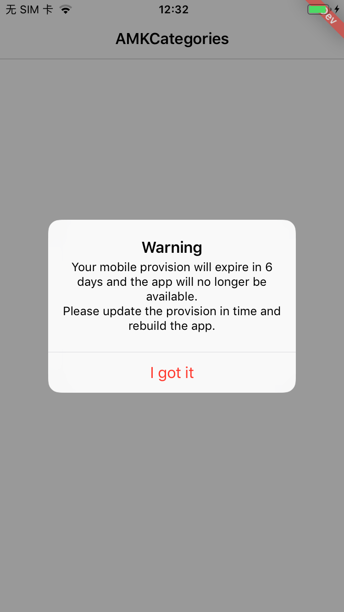

# 

[](https://travis-ci.org/AndyM129/AMKCategories)
[](https://cocoapods.org/pods/AMKCategories)
[](https://cocoapods.org/pods/AMKCategories)
[](https://cocoapods.org/pods/AMKCategories)


## Introduction

* 在 iOS APP 开发过程中，我们会根据需要 切换证书以打出各种用途的安装包，但对于已经安装的APP，却无法识别是通过哪种安装包安装的 —— 是开发包、企业包，还是市场包？

* 由于 iOS 的各种打包证书都有有效期，一但证书过期，通过该证书构建的所有app都将无法打开（打开即闪退，详见 [链接>>](https://www.jianshu.com/p/95ca850e7ece) ），后果是非常严重的，如下图：

  

> 注：通过上传App Store发布、下载安装的app不受影响 —— 无论是过期还是Revoke,甚至是开发者账号被注销,因为这个时候,对于app的签名,是通过苹果私钥直接签名的,没有使用开发者名下的私钥签名

针对以上问题，我们可以通过该扩展类，来标记、提醒开发者与用户。

## Features

使用该库，可以实现：

- 显示当前APP分发模式的角标，如：AppStore、AdHoc、Enterprise、Development
- 查看 `MobileProvision` 文件的过期时间，并支持自动检查并提示

## Example

To run the example project, clone the repo, and run `pod install` from the Example directory first.

## Requirements

- iOS8+

## Installation

AMKCategories is available through [CocoaPods](https://cocoapods.org). To install
it, simply add the following line to your Podfile:

```ruby
pod 'AMKCategories/UIKit/UIApplication/MobileProvision' 
```

## How to use

### 重要说明

⚠️ 该扩展类中，对于 **“ReleaseMode 角标”** 及 **“MobileProvision 过期提示”** 等功能，在 `AMKUIApplicationReleaseModeAppStore`模式 （即 通过“用于上传App Store的打包证书”所构建导出的安装包）下会强制禁用、关闭，以免影响市场包的正常使用，请放心接入！


### Import

```objective-c
#import <AMKCategories/UIWindow+AMKReleaseMode.h>
```

### ReleaseMode 角标

|  |  |  |  |  |  |
| ------------------------------------------------------------ | ------------------------------------------------------------ | ------------------------------------------------------------ | ------------------------------------------------------------ | ------------------------------------------------------------ | ------------------------------------------------------------ |
| Unknown                                                      | Sim                                                          | Dev                                                          | AdHoc                                                        | AppStore                                                     | Enterprise                                                   |

```objective-c
[UIApplication.sharedApplication setAmk_releaseModeCornerMarkEnable:YES];
```

### MobileProvision 过期提示

* MobileProvision 剩余有效时间少于指定天数（可配）时，会弹窗提示，并支持下次启动时“不再提醒”

| 中文                                    | 其他                                    |
| ---- | ---- |
|  |  |


* 若 MobileProvision 剩余有效时间少于7天时，会强制弹窗提示（忽略“不再提醒”的选项）

| 中文                                    | 其他语言                                  |
| ---- | ---- |
|  |  |

```objective-c
[UIApplication.sharedApplication amk_showAlertIfMobileProvisionWillExpireInDays:30];
```

## Author

AndyMeng, andy_m129@163.com

## Collaboration
Feel free to collaborate with ideas, issues and/or pull requests.

## License

AMKCategories is available under the MIT license. See the LICENSE file for more info.